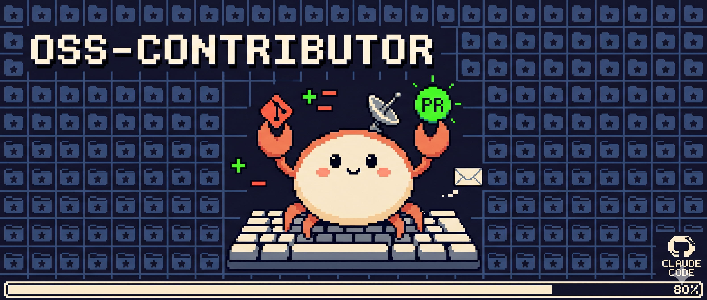

# OSS-Contributor

> Tell it a tech domain you care about, and it discovers the best open-source contribution opportunities, generates a reviewable report, and submits PRs — after your approval.

[MIT](./LICENSE) · [Claude Code Skill](https://code.claude.com/docs/en/skills)

<p align="center">
  
</p>

---

## Why This Exists

High-quality PRs to well-known open-source projects are among the most persuasive credentials in the competitive LLM/AI job market. But the gap between "I want to contribute to the LLM space" and actually submitting a mergeable PR is wide:

- Manually trawling GitHub Trending, awesome lists, and community discussions to find active repos
- Reading CONTRIBUTING.md files one by one to gauge newcomer-friendliness
- Scanning hundreds of issues to find the one that matches your skill level, has merge potential, and delivers real value
- After contributing, lacking a structured narrative to present in interviews

**OSS-Contributor automates discovery and evaluation — but leaves the final decision and execution approval in your hands.**

---

## Quick Start

### Prerequisites

```bash
# Install and authenticate GitHub CLI
gh auth login

# Verify
gh auth status
```

### Installation

```bash
# Clone and install as a Claude Code skill
git clone https://github.com/Ottohere-Mourn/OSS-Contributor.git
cp -r oss-contributor/.claude/skills/oss-contributor ~/.claude/skills/

# Edit preferences (optional)
vim ~/.claude/skills/oss-contributor/config.yaml
```

### Usage

In Claude Code, just say:

> "Find me some open-source projects in the LLM inference space that I can contribute to"

Or use the slash command:

```bash
/oss-contribute "LLM inference" --topk 3 --type docs,bugfix
```

The skill auto-triggers from natural language — no need to memorize exact syntax.

**After PRs are submitted, follow up on reviews:**

```bash
/oss-contribute followup --session 20260530-143000
```

---

## Pipeline

```
Input: domain keyword (e.g., "LLM inference optimization")
  │
  ▼
┌──────────────────────────────────────────────┐
│ 1. Discover                                  │
│    Multi-dimensional search → cross-validate │
│    Human-in-the-loop: confirm dimensions      │
│    Output: repos.json                        │
└──────────────────────────────────────────────┘
  │
  ▼
┌──────────────────────────────────────────────┐
│ 2. Evaluate                                  │
│    Deep-dive Top-K repos: code audit + matrix│
│    Output: opportunities.md                  │
└──────────────────────────────────────────────┘
  │
  ▼
┌──────────────────────────────────────────────┐
│ 3. Review (Human Gate)                       │
│    Review opportunity report → select targets│
│    Output: selection.json                    │
└──────────────────────────────────────────────┘
  │
  ▼
┌──────────────────────────────────────────────┐
│ 4. Execute                                   │
│    Worktree isolation → TDD → PR submission  │
│    Auto-retry on failure + lesson relay      │
│    Output: pr-links.json                     │
└──────────────────────────────────────────────┘
  │
  ▼
┌──────────────────────────────────────────────┐
│ 5. Report                                    │
│    Interview-ready contribution retrospective│
│    Output: contribution-report.md            │
└──────────────────────────────────────────────┘
  │
  ▼
┌──────────────────────────────────────────────┐
│ 6. Followup                                  │
│    /oss-contribute followup --session <id>   │
│    Check PR status + handle review feedback  │
└──────────────────────────────────────────────┘
```

---

## How It Differs

| | OSS-Contributor | Sweep AI | auto-github-contributor | autonomous-dev-team |
|---|---|---|---|---|
| Domain discovery | ✅ Multi-dimensional | ❌ | ❌ | ❌ |
| Human-in-the-loop gates | ✅ Two review points | ❌ | Partial | ❌ |
| Code-level evaluation | ✅ Shallow clone verification | ❌ | ❌ | ❌ |
| Structured reporting | ✅ Interview-ready | ❌ | ❌ | ❌ |
| PR followup | ✅ `/followup` command | ❌ | ❌ | ❌ |
| Auto-merge | ❌ Deliberately omitted | ✅ | ❌ | ✅ |

**Core philosophy**: OSS-Contributor accelerates discovery and evaluation, but keeps decision-making and execution approval entirely under your control. It never auto-merges code.

---

## Configuration

Edit `~/.claude/skills/oss-contributor/config.yaml`:

```yaml
defaults:
  topk: 5                  # Repos to deep-evaluate
  min_stars: 500           # Minimum stars threshold
  languages: ["Python"]    # Language preference (empty = any)
  types: ["bugfix", "docs", "test"]  # Contribution type preference
  exclude_repos:           # Repos to always skip
    - "tensorflow/tensorflow"

profile:
  name: "Your Name"
  github_username: "Ottohere-Mourn"

search:
  max_pages: 3
  sort_by: "stars"
  min_updated_days: 180

execution:
  max_iterations: 20
  require_human_gate: true
```

Command-line flags override config values.

---

## Safety Boundaries

- **Never**: force push, commit to main/master, skip pre-commit hooks
- **Human gate is non-bypassable**: Phase 3 review cannot be skipped
- **Worktree isolation**: each PR operates independently — no cross-contamination
- **No credential management**: authentication is delegated to `gh auth` — the skill never touches tokens
- **Followup never comments unattended**: beyond "thanks, addressed!" replies, nothing is posted without human approval

---

## File Structure

```
.claude/skills/oss-contributor/
├── SKILL.md                    # Main orchestration (6 Phases)
├── config.yaml                 # User preferences
├── prompts/
│   ├── discover.md             # Phase 1: Multi-dimensional search + scoring
│   ├── evaluate.md             # Phase 2: Deep evaluation + code verification
│   ├── execute.md              # Phase 4: Worktree execution + TDD
│   ├── followup.md             # Phase 6: PR followup
│   └── report.md               # Phase 5: Report generation
└── templates/
    ├── repos-schema.json        # Repo data schema
    ├── opportunities-schema.json # Opportunity data schema
    └── report-template.md       # Report output template
```

---

## Related Work

The following projects informed the design of this skill:

- [auto-github-contributor](https://github.com/nexu-io/auto-github-contributor) — Execution pipeline reference
- [autonomous-dev-team](https://github.com/zxkane/autonomous-dev-team) — Worktree isolation patterns
- [WhatIfWeDigDeeper/agent-skills](https://github.com/WhatIfWeDigDeeper/agent-skills) — Skill engineering benchmarks
- [Sweep AI](https://sweep.ai/) — Pioneered issue-to-PR automation

---

## License

MIT
